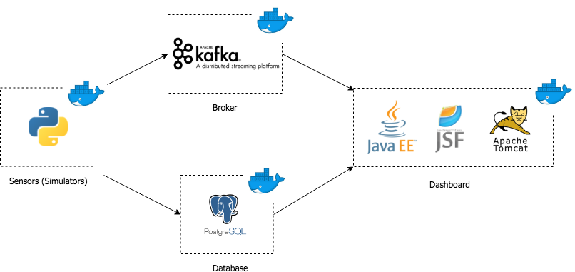

Architecture
============

Logical Architecture
--------------------

		
Figure 10: Logical Architecture

Components
^^^^^^^^^^
* **Sensors (simulators)**: generation of values for the simulation of real data from sensors.

* **Kafka (broker)**: used to handle the real-time data transmitted by the sensors and it is used to read and write streams of data like a messaging system. In other words, it's the message broker that makes the bridge between the sensors and the server.

* **Database**: PostgreSQL database where are stored the values read from the sensors (simulators).

* **Dashboard**: user interface where realtime data and previous values are displayed to the user. This UI was implemented with JSF (and Primefaces) and is deployed with Tomcat (Java web server). In the dashboard, the user can see the realtime information (sent by the broker) in tables and previous values in charts (values that came from queries to the database). 

Deployment Architecture
-----------------------

Connections
^^^^^^^^^^^
* **Sensors** send messages to broker (Kafka on port 9092) to topic *SensorsValues*.
* **Consumer** gets the messages from the broker and stores them at the database (*PostgreSQL* on port 5432 if it is in localhost or port 5555 if it's in the virtual machines).
* **Consumer** also sends messages to broker for an actuator to read those messages (*topic: ConsumerOrders*).
* **Dashboard** receives information from the *Kafka* broker (in realtime) and from the database (historic).
* **ELK**: filebeats gets the logfiles from the consumer and sends them to the *Logstash* who sends to *lasticsearch* and then displays the data in *Kibana*.

- **Ports**:
	- *Kafka*: 9092
	- *PostgreSQL*: 5432 (localhost) or 5555 (VM)
	- *Adminer (Database Manager)*: 8010
	- *Dashboard*: 8888
	- *Consumer (exposed ports)*: 5432 or 9092

- **Containers**:
	- kafka
	- lightsactuator
	- simtemp
	- simhum
	- simuco2
	- simmov
	- simen
	- consumer
	- postgres
	- adminer
	- dashboard
	- elk

- **Containers in the VM**: 
	- simtemp
	- simhum
	- simco2
	- simmov
	- simen (sensors) 
	- lighstactuator (actuador)
	- consumer
	- dashboard 
	- adminer
	- elk

- **Docker-compose**:
	- *Dashboard*: admin-starter.war file running on tomcat servlet.
	- *Consumer* running on python3 environment with *kafka-python* and *psycopg2* packages.
	- *Sensors* and *actuator* running on python3 with *kafka-python* package (only for system testing).
	- *Database (PostgreSQL)*: 
		- database name: domotics 
		- user: postgres
		- password: secret
		- tables that should be created: presented in SQL file in Dockerbuilds/Postgresql/domotics_tables.sql
	- *Adminer image* from docker hub.

BUS, Exposed API and External Interfaces
----------------------------------------

The sensors will send values to the **topic** SensorValues through a **Kafka producer** in Python. This values will be sent along with the **key** that identifies them: temperature, humidity, CO2, movement or energy.

After the values are sent, the dashboard has a **consumer** implemented in Java that uses **Kafka Streams** to read the values from the producer. The consumer checks the key sent and save the values in their respective "field" in a ArrayList. There were implemented functions that show in the dashboard the last value received according to the key and functions that process and calculate the average of all the values received.

