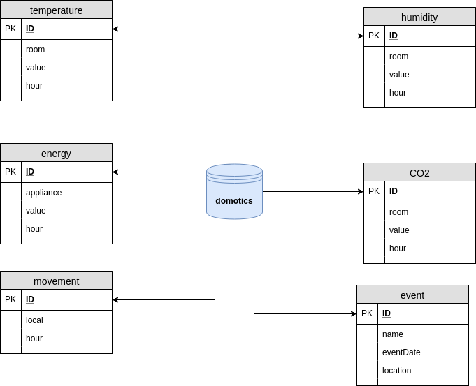

Developer
=========

System Rationale
----------------

For any user the most important part of a management platform of your smart home is the easy access and the simplicity of the interaction with the same. Thus, our system supports a simplistic and user-friendly interface. Our platform presents important information for the management and control of the environment and it is also possible to visualize all the data in a main dashboard.

Deployment Strategy
-------------------

* How to use Jenkins?

1. Download this: http://mirrors.jenkins.io/war-stable/latest/jenkins.war
2. Copy file to repository and run ``“./jenkins.sh -PORT”``
3. Open ``http://localhost:PORT``
4. New Item - Pipeline - Set GIT project url: https://code.ua.pt/git/es2017-2018_g302 - Set Jenkinsfile path: DockerBuils/JenkinsFile

In our deployment strategy using Jenkins, we have a Jenkinsfile. This file contains a pipeline with three stages: "Build Dashboard", “ELK”, "Build" and "Deploy".

Information for the Developer
-----------------------------

Architecture of the System Implementation
^^^^^^^^^^^^^^^^^^^^^^^^^^^^^^^^^^^^^^^^^
* **Sensors (simulators)**: generation of values for the simulation of real data from sensors.

* **Kafka (broker)**: used to handle the real-time data transmitted by the sensors and it is used to read and write streams of data like a messaging system. In other words, it's the message broker that makes the bridge between the sensors and the server.

* **Database**: PostgreSQL database where are stored the values read from the sensors (simulators).

* **Dashboard**: user interface where realtime data and previous values are displayed to the user. This UI was implemented with JSF (and Primefaces) and is deployed with Tomcat (Java web server). In the dashboard, the user can see the realtime information (sent by the broker) in tables and previous values in charts (values that came from queries to the database).

Choice of Technologies
^^^^^^^^^^^^^^^^^^^^^^
For our project it was necessary to define 3 groups of main components that interconnected each other simply and efficiently.

For the database component, it was decided to use **PostgreSQL** because it is a relational database and is the most advanced and extensible system. This open-source system enables interaction with object-oriented languages ​​such as Java and allows a practical interaction with Python, a widely used language. Thus, it is possible to interact with our database with either one language or another.

For the broker, it was initially defined the use of RabbitMQ, but this type of broker does not allow the exchange of messages between different topics so it has been changed and our system is currently using **Kakfa**, allowing several users to have access to our platform.

The interaction with our platform is made through a dashboard implemented in **JavaServer Faces** because it is a Java specification for building web application interfaces. As this programming model is event oriented it becomes simpler to organize the application components.

In this way, Domotics manages to have an architecture with strong and directly connected technologies allowing good communication between the main components.

Data/Information & Exposed API
^^^^^^^^^^^^^^^^^^^^^^^^^^^^^^

Database Scheme
"""""""""""""""
- Our database has a table for each parameter the sensors can measure:
	- Temperature
	- Humidity
	- CO2 levels
	- Movement
	- Luminosity
	- Energy Consumption

* In the tables from the parameters present above, there are the following fields: *ID* (serial), *room* (varchar(30)), *value* (int) and *hour* (varchar(30)).

* Besides the sensors, there is also a table for the **Events** (events that the user can schedule in his or her calendar). The event table has the following fields: *ID* (serial), *name* (varchar(30)), *eventDate* (date) and *location* (varchar(30)).

        
Figure 12: Database Scheme

Messages Exchanged
""""""""""""""""""

Our exchanged messages consist of the "key | value" format. According to the key received in the defined topic, *SensorValues*, our system obtain the respective value sent.

How to deploy?
^^^^^^^^^^^^^^

1. Requirements
"""""""""""""""
* Database of name *domotics* with *user* “postgres” and *password* “secret”. Also, create the required tables present in the python file by running *python3 createTables.py*.
* Kafka broker running.
* PostgreSQL database running with port 5432 exposed.

2. Deployment
"""""""""""""
- **Connecting sensors**: have sensors sending messages with format *“id|value”* to kafka broker: *<kafkabrokerip>:9092*. Messages are sent to topic *“SensorsValues”*. Actuators send to the same topic but also receive from topic *“ConsumerOrders”*.

- **System deploy**:
    - Full system with sensors, broker, database, consumer:
        - Run ``docker-compose up``.
    - System with *Kafka* broker and database *PostgreSQL* installed:
        - Run (with simulators and actuator):
            1. Edit file *docker-compose_vm.yml*: change command to, for example: [“./wait-for-it.sh”, “kafka”, “python”, “consumerMain.py”, “<kafkamachine>:9092”] where *<kafkamachine>* is the hostname of broker or IP address. For sensors: "command: [ “python”, “simMain.py”, “<simtype>“, ”<kafkamachine>:9092”] where *<simtype>* is the type of value sent (“temperature”, “humidity”, “co2”, “movement”, “energy”).
            2. Run: ``docker-compose -f docker-compose_vm.yml up``.
        - Run (without simulators): same as above but eliminate the simulators services in the *docker-compose_vm.yml* file: simen, simco2, simen, simmov, simhum, lightsactuator.

- **Usage**:
    - After deploying, accessing the dashboard: ``http://<tomcatservletmachineAddress>:8888/admin-starter/``
    - Accessing the database: ``http://<adminerMachine>:8010`` and fill the text boxes with: *server* (<postgresmachine name or ip:port>), *user* "postgres", *password* "secret", *database* domotics and type *PostgreSql*.

