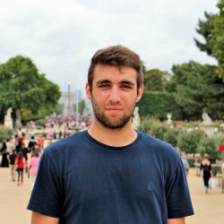

Team
====

Students
--------

1. Ana Rita Santiago, MEC: 72099, ana.rita.santiago@ua.pt

.. figure:: html/_static/antonioramos.png

2. António Ramos, MEC: 30928, antonio.pedro@ua.pt

3. Filipe Macário, MEC: 64618, filipemacario@ua.pt

4. Francisco Cunha, MEC: 76759, franciscomiguelcunha@ua.pt

5. Raquel Ramos, MEC: 76538, raquel.oliveira.ramos@ua.pt

6. Ricardo Silva, MEC: 68067, ferreiraricardo@ua.pt

Weekly Report
-------------
- Week 1
	- Team meeting to define project's objectives.
- Week 2
	- Filling M1 documentation.
	- Simulators' code development.
- Week 3
	- Team meeting.
	- Start looking to PostgreSQL.
	- Docker deployment.
	- Changes in simulators for different divisions.
	- RabbitMQ deployment and testing.
	- Start looking at web applications.
- Week 4
	- PostgreSQL implementation with Java and Python.
	- Values in realtime coming directly from broker.
- Week 5
	- Dashboard done and presented to user with Tomcat.
	- Data processing (averages).
	- Events on database and dashboard.
	- Values in realtime from broker presented in tables of the dashboard.
	- Previous values from database presented in charts showing variation over time.
	- Xcoa website and documentation for M2.
- Week 6
	- Team meeting.
- Week 7
	- Improvement of dashboard: becoming more intuitive to the user.
	- Data processing: search.
	- Adding and testing RabbitMQ consumer in Java.
- Week 8
	- Data processing: insert events.
	- Getting broker ready for events.
	- Improvement of dashboard.
- Week 9
	- Fix PostgreSQL bugs.
	- Changing RabbitMQ to Kafka.
	- Deploying Kafka producer and consumer on project.
	- Fix dashboard and UI for charts.
- Week 10
	- Team meeting.
	- Improvement of charts.
- Week 11
	- Search on dashboard.
	- Adding Kafka consumer in Java: fixed bugs.
	- Calendar for user's events on dashboard.
	- Notifications/alarms for values of sensors.
- Week 12
	- Team meeting.
	- Actuators.
- Week 13
	- Team meeting.
	- Fix events on dashboard.
	- Adding, deploying and testing Kakfa consumer calculating averages in Java.
	- BDD tests.
- Week 14
	- Notifications/alarms being showed on dashboard. 
	- Writing documentation.
- Week 15
	- Team meeting.
	- Fix issues on PostgreSQL: events.
	- Jenkins.
	- ELK.
	- Writing documentation.
- Week 16
	- Team meeting.
	- Jenkins.
	- ELK.
	- Writing documentation.
- Week 17
	- Finish writing documentation.

Team Work
---------

Group's timesheet: https://docs.google.com/spreadsheets/d/14GpPbtH0TMQ1nUEavEsI64Z0etfDdRXNMnr-SqUtCkA/edit?usp=sharing

